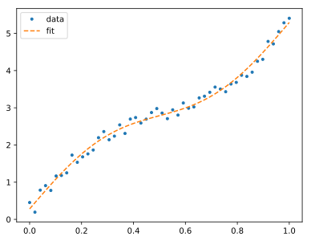

# LeastSquareCalib

A convenience library to fit truncated series (like polynomials) to data. The resulting calibration can be stored as a dictionary, wherein string expressions encode functions.

## Warning

This library uses [`eval`](https://docs.python.org/3/library/functions.html#eval), which is [not safe](https://nedbatchelder.com/blog/201206/eval_really_is_dangerous.html).

## Simple example

Generate noisy data:

```python
from pylab import *

x = linspace( 0, 1, 50 )
y = 5*x + 0.5*sin( 2*pi*x ) + 0.5*rand( len(x) )

plot( x, y, '.' )
```

Create a fit series with a first-order polynomial, and a sine function:

```python
from LeastSquareCalib import CalibSeries

calib = CalibSeries().from_dict( [
    dict( expression = 'x**i', coeffs = [0]*2 ),
    dict( expression = 'np.sin( x*2*np.pi*( i + 1) )', coeffs = [0]*1 )
    ], safe = True )
```

The initial values of the coefficients don't matter. Fit to data:

```python
calib.fit_to_data( x, y )
print( calib.to_dict() )
```

```
>>> [{'expression': 'x**i', 'coeffs': [0.28142438610775405, 5.011667743660484]}, {'expression': 'np.sin( x*2*np.pi*( i + 1) )', 'coeffs': [0.4983928797062334]}]
```

To see the result:

```python
plot( x, calib.evaluate(x) )
```


